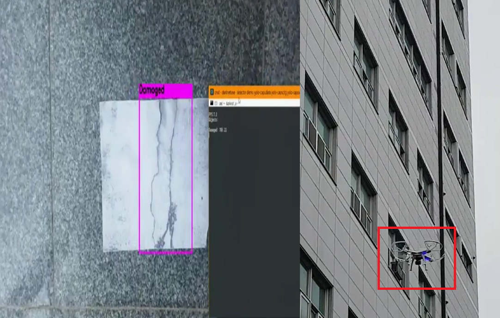

#** 조선대학교 컴퓨터공학과 산학캡스톤디자인 (2018-1)**

## 1. 프로젝트 개요
고층건물, 접근하기 어려운 시설물 등 사람이 직접 육안으로 접근하여 관찰하는 작업을 무인항공기를 통해 보다 효율적으로 관리할 수 있게 됩니다. 또한 기존에는 사람이 직접 확인하는 방식이였고 육안으로 해결하다보니 100% 문제점을 검출하지 못하는 부분도 많았지만 이런부분까지도 프로그램이 자동으로 사용자에게 알려주어 조기 발견 후 신속히 조치가 가능하게 될 전망입니다. 또한 무인기를 통하여 시설물 안전관리 뿐아니라 활용분야를 폭넓게 다양한 분야에서 확대하여 사용 가능합니다.

## 2. 개발 환경
<b>OS</b> : `Window10-Redstone3`
<b>Tool</b> : `Visual Studio 2015`, `Android Studio(2.3.3)`,
                `nodeJs 8.11.1 LTS`, `mongoDB`
<b>OSS</b> : `YOLO v3(You Only Look Once)`

## 3. 프로젝트 내용

## 4. 팀원 및 역할
|  연번 |  성명 |  학번 	|  	역할         	|
|:--------:|:--------:|:--------:|:--:|
|1| 이대경 |20124956|Android & MySQL & 총괄 팀장|
|2 | 송남주 |20124918|MongoDB & Node.js|
|3 | 김지웅 |20124899|MongoDB & Node.js|
|4 | 강일송 |20134845|YOLO 학습 & 이미지 검출|
|5 | 김지우 |20144758|YOLO 학습 & 이미지 검출|

## 5. License

YOLO LICENSE

Version 2, July 29 2016

THIS SOFTWARE LICENSE IS PROVIDED "ALL CAPS" SO THAT YOU KNOW IT IS SUPER
SERIOUS AND YOU DON'T MESS AROUND WITH COPYRIGHT LAW BECAUSE YOU WILL GET IN
TROUBLE HERE ARE SOME OTHER BUZZWORDS COMMONLY IN THESE THINGS WARRANTIES
LIABILITY CONTRACT TORT LIABLE CLAIMS RESTRICTION MERCHANTABILITY. NOW HERE'S
THE REAL LICENSE:

0. Darknet is public domain.
1. Do whatever you want with it.
2. Stop emailing me about it!
